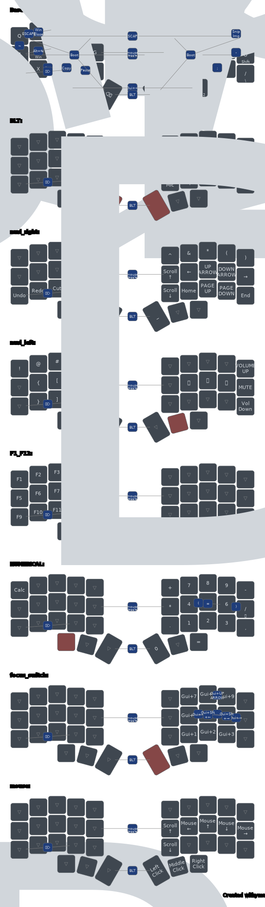

# Keyboard Layout Documentation

## Base Layout  
The foundation is **Colemak-DH**, with additional modifications on the right hand.  
- Instead of `/` on the bottom-row pinky key, there is `;`, which in Greek is used for accenting letters (e.g., ά, έ, ί, ό, ή, ύ, ώ) and shifted accents like ϊ.  
- Instead of `;` on the top-row pinky key, there is `'`.  
- This layout **does not** include home-row mods, as it is designed for speed, minimizing accidental modifier activations while typing or switching between Greek and English—even within the same sentence.  

## Thumb Clusters  

### On Tap  
**Left:** `Esc`, `Space`, `Shift-next-character`  
**Right:** `Enter`, `Backspace`, `Delete`  

- **Neutral thumb positions** (easiest to reach) are assigned to **Space** and **Backspace**, as they are the most frequently used.  
- **Outer thumb positions** (faster but less precise) are used for **Shift-next-character** (e.g., capitalizing the first letter in a rolling motion) and **Enter** (for quick new-line creation).  
- **Inner thumb positions** (harder to reach) are used for **Escape** and **Delete**, as they are less common and should not be hit accidentally.  
- The layout is strongly influenced by **Miryoku**, though **Tab** was replaced with **Shift-next-character** on the left outer thumb key.  

### On Hold  
**Left:** `Bluetooth`, `Navigation`, `Numbers`  
**Right:** `Symbols`, `Mouse`, `Function`  

- Inspired by **Miryoku**, where one thumb activates a layer while the other hand uses that layer's main keys and combos.  
- Standard Miryoku assigns `Media`, `Navigation`, `Mouse` on the left and `Symbols`, `Numbers`, `Function` on the right.  
- However, I swapped **Numbers** and **Mouse** because I found it unnatural to type numbers with my left hand.  
- Since the **Numbers layer** is used frequently, it shouldn't be placed in the inner palm position. Instead, it occupies the **left outer palm key**, keeping **Navigation** in the **neutral thumb position**.  
- This change led to placing the **Mouse trigger** in the **right-hand neutral thumb position**, as it mirrors the **inverted-T movement pattern** I use in games with my left hand.  

## Two-Key Combos  
Having **Choc switches and flat keycaps** enables comfortable multi-key presses with a single finger.  

- **Single middle-left finger (`F`, `S`)** → Activates a **single digit** from the **Numbers layer** and returns to base.  
- **Single middle-right finger (`U`, `E`)** → Activates a **single digit** from the **Symbols layer** and returns to base.  
- **Both momentary and sticky layer triggers** remain consistent with the hand used to activate them.  

Since **Tab** was moved to the left outer thumb key, I needed a **quick-access Tab key**:  
- **Single right index finger (`L`, `N`)** → **Tab**  
- **Single left index finger (`P`, `T`)** → **Switch language (`Win+Space` / `Alt+Shift`)**, allowing seamless Greek-English transitions within a sentence.  

## Three-Key Combos (Layer Toggles)  
For **Mouse** and **Navigation** layers, I needed a more ergonomic toggle option, as I spend extended time in these modes while browsing or navigating files.  

- A **three-key, three-finger combo** was created for each layer, using dominant fingers in their **neutral positions**.  
- These toggle triggers are placed within the **Mouse and Navigation key zones**, allowing:  
  - **Single-handed use** (e.g., when using a mouse or holding a coffee).  
  - **Convenient layer switching** without disrupting workflow.  

## Numbers Layer  
- The **Numbers layer** is structured similarly to a numpad, prioritizing efficiency in numeric entry.  
- **Top row:** `7 8 9`  
- **Home row:** `4 5 6`  
- **Bottom row:** `1 2 3`  
- **Thumb cluster:** `0`, `.` (decimal), and `Enter`.  
- Additional functions include `+`, `-`, `*`, `/`, and `=` for fast calculations.  

## Symbols Layer  
- The **Symbols layer** includes frequently used programming and punctuation symbols.  
- Layout follows a **logical grouping**:  
  - `@`, `#`, `$`, `%`, `&`  
  - `(`, `)`, `{`, `}`, `[`, `]`  
  - `=`, `+`, `-`, `*`, `/`, `\`  
  - Arrow keys are included on the right-hand side for quick navigation.  

## Navigation Layer  
- Provides **efficient text and file navigation** without moving hands from the home position.  
- **Left hand:** Home, End, Page Up, Page Down.  
- **Right hand:** Arrow keys in an inverted-T layout.  
- Additional keys: `Ctrl+Arrow` shortcuts for faster word movement.  

## Mouse Layer  
- Designed for **precise control** over cursor movement.  
- **Right-hand inverted-T movement** mirrors gaming muscle memory.  
- **Left-hand shortcuts**: Left click, Right click, Middle click, Scroll.  
- Additional keys: DPI adjustment and drag lock for easier selection.  

## Function Layer  
- Includes **F1-F12 keys** in a standard layout.  
- Macro shortcuts: Custom scripts for automation.  

## Bluetooth & Media Layer  
- **Left hand:** Controls Bluetooth connections and device switching.  
  - `BT1`, `BT2`, `BT3` for different devices.  
  - `Pairing mode` shortcut.  
- **Right hand:** Media control keys.  
  - `Volume Up`, `Volume Down`, `Mute`.  
  - `Play/Pause`, `Next Track`, `Previous Track`.  
- The **Media Layer** allows quick control of music or video playback without disrupting workflow.  

This structure ensures a **balanced, efficient workflow** across typing, navigation, programming, and mouse control while maintaining **ergonomic comfort**.
